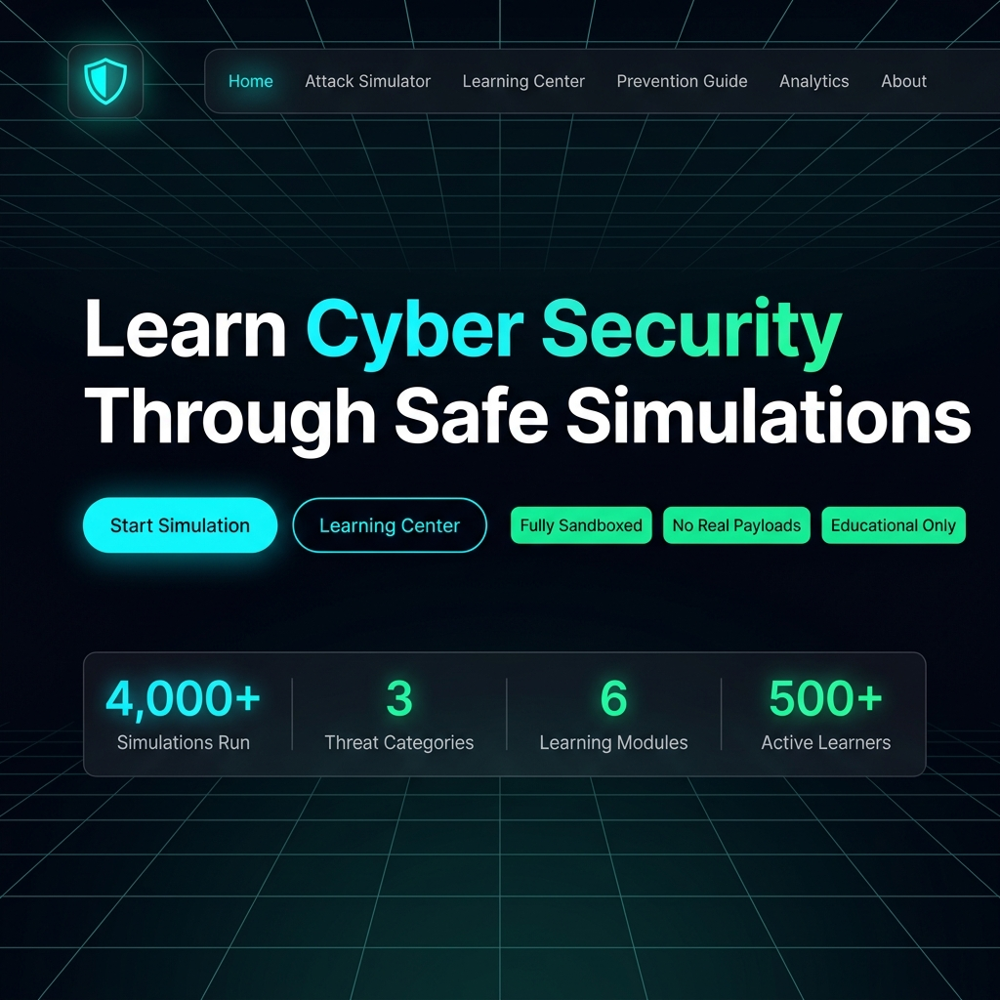
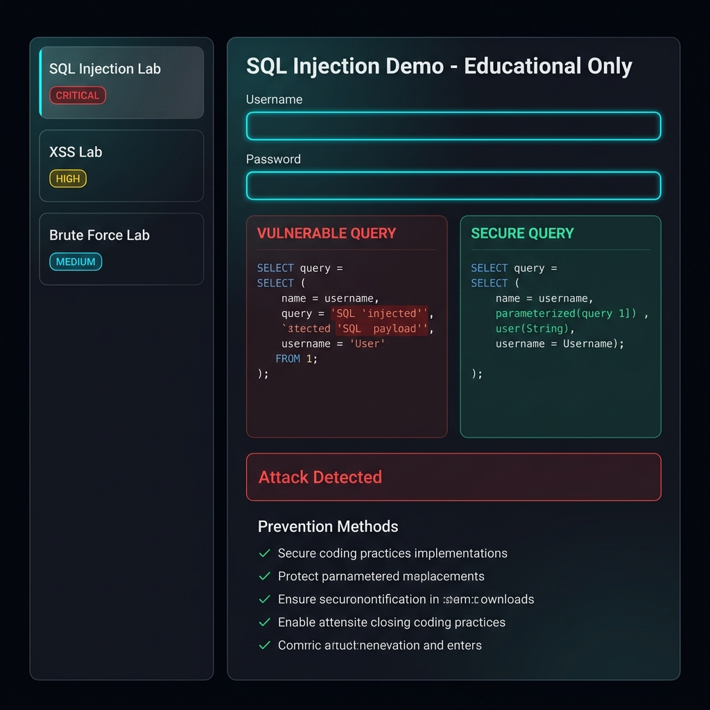
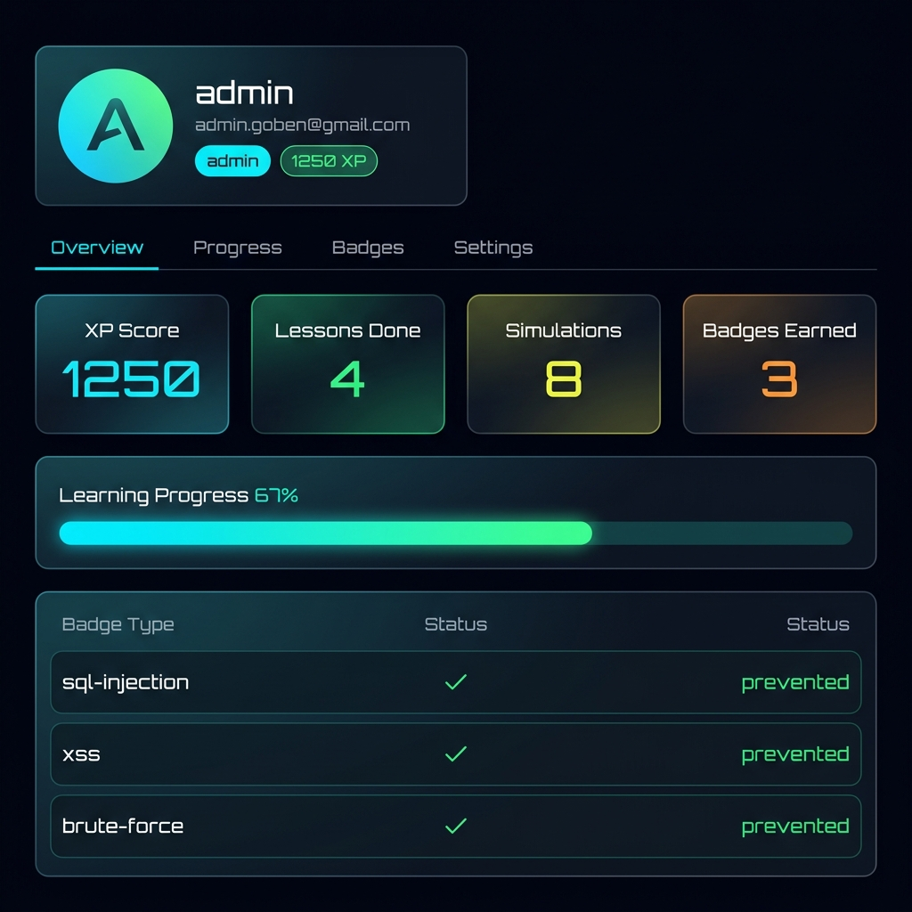
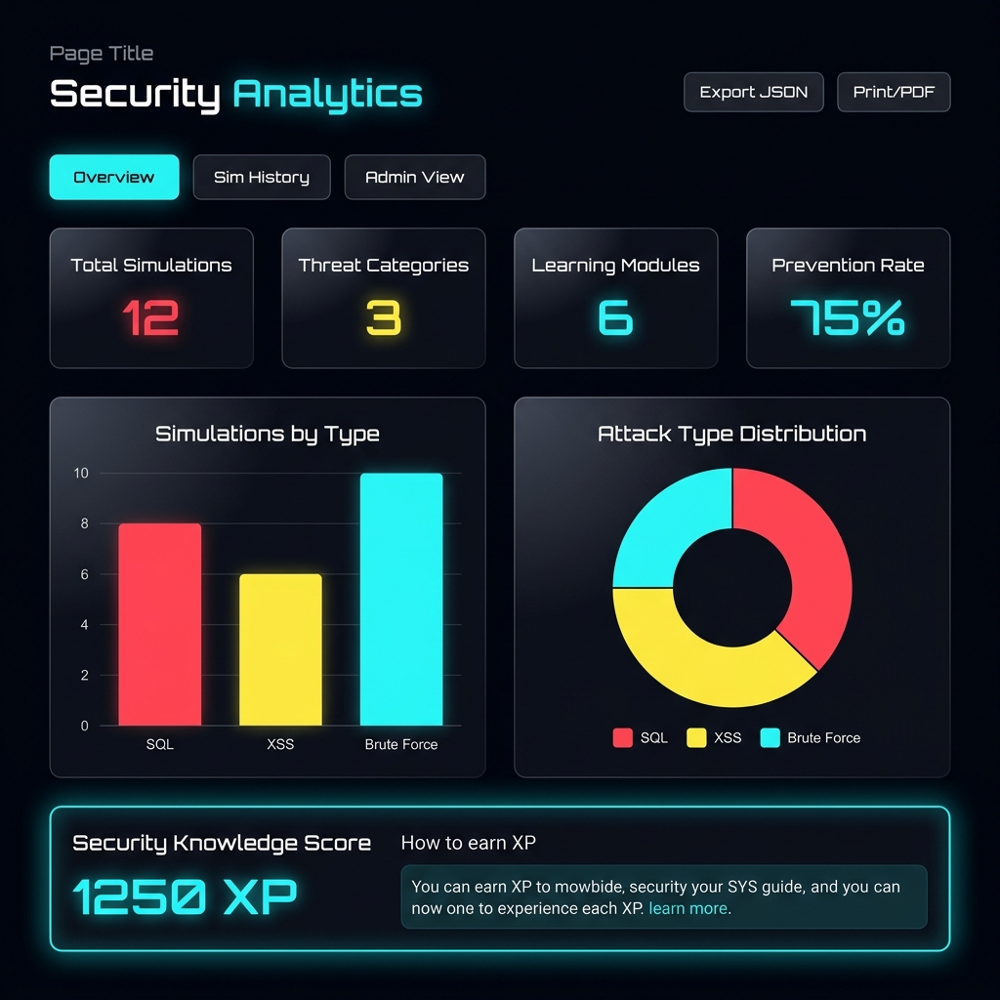

<div align="center">



<br/><br/>

# 🛡️ Cyber Attack Simulation Lab

### *Interactive Cybersecurity Training Platform*

[](https://reactjs.org/)
[](https://nodejs.org/)
[](https://vitejs.dev/)
[](https://expressjs.com/)
[](https://sqlite.org/)
[](https://docker.com/)
[](https://jwt.io/)
[](./LICENSE)

**A production-quality, futuristic cybersecurity education platform built to teach real attack techniques through completely safe, sandboxed simulations.**

[🚀 Live Demo](#-quick-start) • [📖 Documentation](#-documentation) • [🐳 Docker Deploy](#-docker-deployment) • [👨‍💻 Author](#-author--credits)

---

> ⚠️ **EDUCATIONAL USE ONLY** — No real attacks are executed. All simulations run in a fully sandboxed environment. This platform is designed exclusively for cybersecurity education.

</div>

---

## 📸 Screenshots

<table>
  <tr>
    <td width="50%">
      
      <p align="center"><b>🏠 Home Page — Hero & Feature Cards</b></p>
    </td>
    <td width="50%">
      
      <p align="center"><b>⚡ Attack Simulator — SQL Injection Lab</b></p>
    </td>
  </tr>
  <tr>
    <td width="50%">
      
      <p align="center"><b>📊 User Dashboard — XP, Progress & Badges</b></p>
    </td>
    <td width="50%">
      
      <p align="center"><b>📈 Analytics — Charts & Security Metrics</b></p>
    </td>
  </tr>
</table>

---

## 📖 Introduction

**Cyber Attack Simulation Lab** is a startup-quality educational cybersecurity platform that bridges the gap between theory and practice. It provides interactive, hands-on simulations of the most critical web vulnerabilities identified by **OWASP Top 10** — without ever putting real systems at risk.

### 🎯 What You Can Learn

| Attack Type | Severity | What You'll Understand |
|-------------|----------|------------------------|
| 🗄️ **SQL Injection** | `CRITICAL (CVSS 9.8)` | How attackers manipulate database queries; parameterized query defense |
| 💉 **Cross-Site Scripting (XSS)** | `HIGH (CVSS 8.8)` | Script injection, cookie theft, CSP headers, output encoding |
| 🔓 **Brute Force Attacks** | `MEDIUM (CVSS 7.5)` | Dictionary attacks, rate limiting, MFA, account lockout |

### 🔒 Security Architecture
Every simulation is sandboxed:
- Input is **analyzed** but never executed against real databases
- No real SQL queries are injected
- No real JavaScript payloads execute on external sites
- All "attack" results are **pre-computed educational demonstrations**

---

## ✨ Features

### 🔥 Core Modules
- **Attack Simulator** — SQL Injection, XSS, and Brute Force labs with live demos
- **Learning Center** — 6 structured lessons with progress tracking and search
- **Prevention Guide** — Per-attack explanations, symptoms, code examples, case studies
- **Security Checklist** — 29 interactive controls across 5 categories, scored and exportable
- **Cyber Quiz** — 5-category quiz system with XP awards and achievement badges
- **Analytics Dashboard** — Bar/Line/Doughnut charts, simulation history, PDF export
- **Notification Center** — Real-time bell notifications with unread count

### 👤 Authentication & Access
- JWT-based login/register
- Role-Based Access Control (Admin / Student)
- Admin Panel: manage users, view all simulations, analytics, lesson toggle
- User Dashboard: XP score, learning progress, badges, quiz history, profile

### 🎨 Design & UX
- Futuristic SOC (Security Operations Center) theme
- Animated Cyber Grid background + floating particle system
- Glassmorphism cards with neon glow effects
- Light Mode / Dark Mode toggle
- Smooth Framer Motion page transitions
- Custom terminal-style loading screen
- Fully responsive for mobile, tablet, and desktop

### ⭐ Extra Features
- 🏆 Achievement Badge system (auto-awarded on milestones)
- 📄 PDF Report Generation via browser print
- 📥 JSON Analytics Export
- 🔑 Password Strength Analyzer (in Brute Force Lab)
- 🔔 Notification Center with global `notify()` hook
- ✅ Interactive Security Checklist (localStorage persistence)
- 📊 Animated statistics counter on the homepage

---

## 🛠️ Technology Stack

### Frontend
| Technology | Version | Purpose |
|-----------|---------|---------|
| **React.js** | 18.x | Component-based UI framework |
| **Vite** | 5.x | Lightning-fast build tool and dev server |
| **Framer Motion** | 11.x | Smooth animations and page transitions |
| **React Router** | v6 | Client-side routing with lazy loading |
| **Chart.js + react-chartjs-2** | 4.x | Bar, Line, Doughnut analytics charts |
| **Zustand** | 4.x | Lightweight state management (auth + theme) |
| **Lucide React** | Latest | Professional icon library |
| **react-hot-toast** | 2.x | Toast notification system |
| **react-helmet-async** | 2.x | SEO meta tags per page |
| **@tanstack/react-query** | 5.x | Server state management |

### Backend
| Technology | Version | Purpose |
|-----------|---------|---------|
| **Node.js** | 20.x | JavaScript runtime |
| **Express.js** | 4.x | REST API framework |
| **sql.js (WASM)** | 1.x | SQLite in WebAssembly — zero native compilation |
| **jsonwebtoken** | 9.x | JWT authentication |
| **bcryptjs** | 2.x | Password hashing (cost factor 12) |
| **express-validator** | 7.x | Input validation and sanitization |
| **express-rate-limit** | 7.x | Rate limiting on auth endpoints |
| **helmet** | 7.x | Security HTTP headers |
| **morgan** | 1.x | HTTP request logging |
| **cors** | 2.x | Cross-Origin Resource Sharing |
| **uuid** | 9.x | Unique ID generation |

### DevOps & Tools
| Technology | Purpose |
|-----------|---------|
| **Docker** | Containerization |
| **Docker Compose** | Multi-container orchestration |
| **Nginx** | Frontend reverse proxy in production |
| **Google Fonts** | Inter, JetBrains Mono, Orbitron typefaces |

### Design System
- **Color Palette**: Deep Black `#03040a` · Dark Graphite `#111827` · Neon Cyan `#00f5ff` · Electric Green `#00ff88` · Soft White `#f0f6fc`
- **Typography**: `Orbitron` (HUD headings) · `Inter` (body) · `JetBrains Mono` (code)
- **CSS Architecture**: 880-line custom design system with tokens, utilities, and component classes

---

## 📁 Project Structure

```
cyber-attack-simulation-lab/
│
├── 📂 frontend/                      # React + Vite SPA
│   ├── 📂 src/
│   │   ├── 📂 components/            # Reusable UI components
│   │   │   ├── Navbar.jsx            # Sticky navigation + notification bell
│   │   │   ├── Footer.jsx            # Professional footer
│   │   │   ├── LoadingScreen.jsx     # Terminal-style boot animation
│   │   │   ├── ParticleField.jsx     # Canvas particle system
│   │   │   ├── NotificationCenter.jsx# Bell + slide-in notification panel
│   │   │   ├── SecurityChecklist.jsx # 29-item interactive checklist
│   │   │   └── labs/
│   │   │       ├── SQLInjectionLab.jsx
│   │   │       ├── XSSLab.jsx
│   │   │       └── BruteForceLab.jsx
│   │   ├── 📂 pages/                 # Route-level page components (14 pages)
│   │   │   ├── Home.jsx              # Hero, stats, features, timeline
│   │   │   ├── Simulator.jsx         # Lab selector + layout
│   │   │   ├── LearningCenter.jsx    # Lesson grid with search/filter
│   │   │   ├── LessonDetail.jsx      # Section-by-section lesson reader
│   │   │   ├── Prevention.jsx        # Per-attack prevention guide
│   │   │   ├── Analytics.jsx         # Charts, history, PDF export
│   │   │   ├── Checklist.jsx         # Security checklist page
│   │   │   ├── Quiz.jsx              # Quiz selector + engine + results
│   │   │   ├── Dashboard.jsx         # User profile + progress
│   │   │   ├── AdminPanel.jsx        # Admin control panel
│   │   │   ├── About.jsx             # Mission, stack, roadmap
│   │   │   ├── Login.jsx             # JWT login form
│   │   │   ├── Register.jsx          # Registration form
│   │   │   └── NotFound.jsx          # 404 page
│   │   ├── 📂 store/
│   │   │   └── index.js              # Zustand: auth + theme stores
│   │   ├── 📂 lib/
│   │   │   └── api.js                # Axios instance + JWT interceptor
│   │   ├── App.jsx                   # Router + lazy loading + layout
│   │   ├── main.jsx                  # React root + providers
│   │   └── index.css                 # 880-line global design system
│   ├── index.html                    # HTML template with Google Fonts
│   ├── vite.config.js                # Vite config + API proxy
│   ├── tailwind.config.js
│   └── Dockerfile                    # Multi-stage Nginx production build
│
├── 📂 backend/                       # Node.js + Express REST API
│   ├── 📂 src/
│   │   ├── 📂 config/
│   │   │   └── database.js           # sql.js WASM engine + DbWrapper + seed
│   │   ├── 📂 middleware/
│   │   │   └── auth.js               # JWT verify + RBAC middleware
│   │   └── 📂 routes/
│   │       ├── auth.js               # /api/auth/*
│   │       ├── users.js              # /api/users/*
│   │       ├── lessons.js            # /api/lessons/*
│   │       ├── quiz.js               # /api/quiz/*
│   │       ├── simulations.js        # /api/simulations/*
│   │       ├── analytics.js          # /api/analytics/*
│   │       └── admin.js              # /api/admin/* (admin only)
│   ├── server.js                     # Express app entry point
│   ├── .env                          # Environment variables
│   ├── package.json
│   └── Dockerfile                    # Node 20 Alpine production image
│
├── 📂 docs/                          # Documentation
│   ├── 📂 screenshots/               # App screenshots for README
│   ├── ER_DIAGRAM.md                 # Database entity-relationship diagram
│   ├── UML_DIAGRAM.md                # System UML diagrams
│   ├── API_DOCUMENTATION.md          # Full API reference
│   ├── DOCKER_GUIDE.md               # Docker setup guide
│   └── SECURITY_CONSIDERATIONS.md   # Security architecture
│
├── docker-compose.yml                # One-command full-stack deployment
├── package.json                      # Root workspace scripts
└── README.md                         # This file
```

---

## ⚙️ Requirements

### Local Development
| Requirement | Minimum Version |
|------------|----------------|
| **Node.js** | v18.0.0+ (v20 recommended) |
| **npm** | v9.0.0+ |
| **Git** | Any recent version |

### Docker Deployment
| Requirement | Version |
|------------|---------|
| **Docker** | 24.0+ |
| **Docker Compose** | v2.0+ |

> **No Python, no native modules, no OS-level dependencies required.** The database uses `sql.js` (SQLite compiled to WebAssembly), so there's nothing to compile.

---

## 🚀 Quick Start

### Option 1 — Local Development (Recommended for development)

#### 1. Clone the repository
```bash
git clone https://github.com/MohammadSakibAhmad0874/OpenEnv-AgentOps.git
cd OpenEnv-AgentOps/Cyber\ Attack\ Simulation\ Lab
```

#### 2. Install all dependencies
```bash
# Install root workspace tools
npm install

# Install backend dependencies
cd backend && npm install && cd ..

# Install frontend dependencies
cd frontend && npm install && cd ..
```

#### 3. Set up environment variables
```bash
# The backend .env is already included with safe defaults
# Verify it exists:
cat backend/.env
```

Expected content:
```env
NODE_ENV=development
PORT=5000
JWT_SECRET=CyberLabSuperSecretKey2024_ChangeInProduction!
JWT_EXPIRES_IN=7d
DB_PATH=./data/cyber_lab.db
FRONTEND_URL=http://localhost:5173
RATE_LIMIT_WINDOW_MS=900000
RATE_LIMIT_MAX=100
```

#### 4. Start the backend server
```bash
cd backend
npm run dev
# → API running at http://localhost:5000
# → Database auto-seeded with lessons, quiz questions, demo users
```

#### 5. Start the frontend (new terminal)
```bash
cd frontend
npm run dev
# → App running at http://localhost:5173
```

#### 6. Open the app
```
http://localhost:5173
```

---

### Option 2 — Docker (One-command production deployment)

```bash
# Clone and enter the project
git clone https://github.com/MohammadSakibAhmad0874/OpenEnv-AgentOps.git
cd OpenEnv-AgentOps/Cyber\ Attack\ Simulation\ Lab

# Build and start all containers
docker-compose up --build

# App is now running at:
# Frontend → http://localhost
# Backend  → http://localhost:5000
```

To run in the background:
```bash
docker-compose up --build -d

# View logs
docker-compose logs -f

# Stop all containers
docker-compose down
```

---

## 🔑 Default Login Credentials

| Role | Email | Password | Access |
|------|-------|----------|--------|
| **Admin** | `admin@cyberlab.local` | `Admin@123` | Full platform + Admin Panel |
| **Student** | `student@cyberlab.local` | `Student@123` | All learning features |

> You can also register a new account at `/register`

---

## 📋 Basic Commands

```bash
# ── Development ─────────────────────────────────────────
npm run dev:backend      # Start backend with hot-reload (nodemon)
npm run dev:frontend     # Start Vite dev server

# ── Backend only ─────────────────────────────────────────
cd backend
npm run dev              # Development with nodemon
npm start                # Production start
npm test                 # Run tests (if configured)

# ── Frontend only ─────────────────────────────────────────
cd frontend
npm run dev              # Dev server at :5173
npm run build            # Production build → dist/
npm run preview          # Preview production build

# ── Docker ───────────────────────────────────────────────
docker-compose up --build          # Build + start all services
docker-compose up --build -d       # Detached (background) mode
docker-compose down                # Stop all services
docker-compose down -v             # Stop and remove volumes
docker-compose logs -f backend     # Stream backend logs
docker-compose logs -f frontend    # Stream frontend logs
docker-compose ps                  # Check service status

# ── Database ─────────────────────────────────────────────
# Database is auto-created and seeded on first backend start
# Location: backend/data/cyber_lab.db
# To reset: delete the .db file and restart the backend

# ── Git ──────────────────────────────────────────────────
git status
git add .
git commit -m "your message"
git push origin main
```

---

## 🗄️ Database Schema

```sql
-- Users table
CREATE TABLE users (
  id TEXT PRIMARY KEY,
  username TEXT UNIQUE NOT NULL,
  email TEXT UNIQUE NOT NULL,
  password_hash TEXT NOT NULL,
  role TEXT DEFAULT 'student',       -- 'student' | 'admin'
  score INTEGER DEFAULT 0,           -- XP points
  streak INTEGER DEFAULT 0,
  bio TEXT,
  created_at DATETIME DEFAULT CURRENT_TIMESTAMP,
  last_login DATETIME
);

-- Learning content
CREATE TABLE lessons (
  id TEXT PRIMARY KEY,
  title TEXT NOT NULL,
  slug TEXT UNIQUE NOT NULL,
  category TEXT NOT NULL,
  difficulty TEXT NOT NULL,          -- 'beginner' | 'intermediate' | 'advanced'
  content TEXT,                      -- JSON: { sections: [...] }
  tags TEXT,                         -- JSON array
  duration INTEGER,                  -- minutes
  order_index INTEGER,
  is_active INTEGER DEFAULT 1
);

-- User progress tracking
CREATE TABLE user_progress (
  id TEXT PRIMARY KEY,
  user_id TEXT REFERENCES users(id),
  lesson_id TEXT REFERENCES lessons(id),
  progress INTEGER DEFAULT 0,        -- 0-100%
  completed INTEGER DEFAULT 0,
  time_spent INTEGER DEFAULT 0,      -- seconds
  completed_at DATETIME
);

-- Quiz system
CREATE TABLE quiz_questions (
  id TEXT PRIMARY KEY,
  question TEXT NOT NULL,
  options TEXT NOT NULL,             -- JSON array of 4 options
  answer INTEGER NOT NULL,           -- correct option index
  explanation TEXT,
  category TEXT NOT NULL,
  difficulty TEXT
);

CREATE TABLE quiz_attempts (
  id TEXT PRIMARY KEY,
  user_id TEXT REFERENCES users(id),
  category TEXT NOT NULL,
  score INTEGER,                     -- 0-100
  total INTEGER,
  answers TEXT,                      -- JSON: detailed results
  completed_at DATETIME DEFAULT CURRENT_TIMESTAMP
);

-- Simulation history
CREATE TABLE simulation_history (
  id TEXT PRIMARY KEY,
  user_id TEXT REFERENCES users(id),
  simulation_type TEXT NOT NULL,     -- 'sql-injection' | 'xss' | 'brute-force'
  payload TEXT,                      -- JSON: input parameters
  result TEXT,                       -- JSON: simulation output
  prevented INTEGER DEFAULT 0,       -- 1 = attack was blocked
  created_at DATETIME DEFAULT CURRENT_TIMESTAMP
);

-- Platform analytics
CREATE TABLE analytics (
  id TEXT PRIMARY KEY,
  event_type TEXT NOT NULL,
  user_id TEXT,
  metadata TEXT,                     -- JSON: event data
  created_at DATETIME DEFAULT CURRENT_TIMESTAMP
);

-- Achievement badges
CREATE TABLE achievements (
  id TEXT PRIMARY KEY,
  user_id TEXT REFERENCES users(id),
  badge_id TEXT NOT NULL,
  badge_name TEXT NOT NULL,
  earned_at DATETIME DEFAULT CURRENT_TIMESTAMP,
  UNIQUE(user_id, badge_id)
);
```

---

## 🌐 API Reference

Base URL: `http://localhost:5000/api`

### Authentication
```
POST /auth/register     Create new account
POST /auth/login        Login → returns JWT token
GET  /auth/me           Get current user (requires JWT)
```

### Lessons
```
GET  /lessons                    List all lessons (filters: category, difficulty, search)
GET  /lessons/:slug              Get lesson content by slug
POST /lessons/:id/progress       Save learning progress (JWT required)
GET  /lessons/progress/summary   User's overall progress (JWT required)
```

### Simulations (Educational Only)
```
POST /simulations/sql-injection  SQL Injection demo { username, password, mode }
POST /simulations/xss            XSS demo { payload, mode }
POST /simulations/brute-force    Brute Force demo { targetPassword, attackType, speed }
GET  /simulations/history        User's simulation history (JWT required)
GET  /simulations/stats          Platform-wide simulation statistics
```

### Quiz
```
GET  /quiz/:category              Get quiz questions (categories: sql-injection, xss, brute-force, authentication, web-security)
POST /quiz/:category/submit       Submit answers → score, XP, results (JWT required)
GET  /quiz/history/me             User's quiz attempt history (JWT required)
```

### Analytics
```
GET /analytics/public            Public platform statistics (no auth)
```

### Admin (Admin Role Required)
```
GET    /admin/stats               Platform overview statistics
GET    /admin/users               All registered users (paginated)
DELETE /admin/users/:id           Delete a user account
GET    /admin/simulations         All simulation history (paginated)
GET    /admin/analytics           Daily activity charts (last N days)
PATCH  /admin/lessons/:id/toggle  Toggle lesson active/hidden state
```

---

## 🔐 Security Considerations

| Concern | Implementation |
|---------|---------------|
| **Password Storage** | bcrypt with cost factor 12 |
| **Authentication** | JWT with configurable expiry (default 7 days) |
| **SQL Injection** | Parameterized queries throughout (sql.js prepared statements) |
| **XSS Prevention** | React auto-escaping + Helmet.js CSP headers |
| **Rate Limiting** | 100 requests per 15 minutes on auth routes |
| **CORS** | Restricted to `FRONTEND_URL` environment variable |
| **Input Validation** | `express-validator` on all POST/PUT routes |
| **Admin Routes** | Server-side role check — rejects non-admin JWT at middleware level |
| **No Real Attacks** | All simulation results are pre-computed — user input never reaches a real DB or browser |

---

## 📚 Documentation

| Document | Description |
|----------|-------------|
| [API Documentation](docs/API_DOCUMENTATION.md) | Full REST API reference with request/response examples |
| [ER Diagram](docs/ER_DIAGRAM.md) | Database entity-relationship diagram |
| [UML Diagrams](docs/UML_DIAGRAM.md) | System architecture and flow diagrams |
| [Docker Guide](docs/DOCKER_GUIDE.md) | Detailed Docker setup and deployment guide |
| [Security Considerations](docs/SECURITY_CONSIDERATIONS.md) | Security architecture and design decisions |

---

## 🗺️ Roadmap

### ✅ v1.0 — Current Release
- SQL Injection, XSS, Brute Force Labs
- Learning Center with 6 modules
- Quiz System with 5 categories
- Analytics Dashboard with charts
- Achievement Badges
- Security Checklist (29 controls)
- Notification Center
- PDF Report Generation
- Admin Panel + Role-Based Access
- Docker deployment

### 🔜 v1.1 — Planned
- CSRF Attack Lab
- Directory Traversal Lab
- API Security Module
- Capture The Flag (CTF) Mode
- More quiz questions per category

### 🔮 v2.0 — Future
- AI-powered threat analysis
- Team/Group learning mode
- Enterprise SSO integration
- PDF Certificate Generation
- Mobile app (React Native)

---

## 🤝 Contributing

This is an educational project. Contributions that enhance the learning experience are welcome!

1. Fork the repository
2. Create your feature branch: `git checkout -b feature/new-attack-lab`
3. Commit your changes: `git commit -m 'feat: add CSRF attack lab'`
4. Push to the branch: `git push origin feature/new-attack-lab`
5. Open a Pull Request

**Please ensure:**
- No real attack payloads are introduced
- All simulations remain strictly educational
- Code follows the existing architecture patterns

---

## 📜 License

This project is licensed for **Educational Use Only**.

```
Copyright (c) 2024 Md Sakib Ahmad

Permission is granted to use this software for educational purposes only.
Commercial use, distribution as a real attack tool, or any malicious use
is strictly prohibited.

THE SOFTWARE IS PROVIDED "AS IS", WITHOUT WARRANTY OF ANY KIND.
```

---

## 👨‍💻 Author & Credits

<div align="center">


### **Md Sakib Ahmad**

*Full Stack Engineer · Cybersecurity Educator · UI/UX Designer · Software Architect*

[](https://github.com/MohammadSakibAhmad0874)

</div>

---

### 🏗️ Built By Md Sakib Ahmad

> This platform was architected, designed, and developed entirely by **Md Sakib Ahmad** as a production-quality educational cybersecurity project.

**Responsibilities covered:**
- 🎨 **UI/UX Design** — Designed the complete futuristic SOC theme, design system (880-line CSS), glassmorphism layout, and all micro-animations
- ⚛️ **Frontend Engineering** — Built 14 React pages, 10 components, Zustand state management, Chart.js analytics, and lazy-loaded routing
- 🖥️ **Backend Engineering** — Developed REST API with Express.js, JWT authentication, RBAC middleware, and 7 route modules
- 🗄️ **Database Architecture** — Designed 8-table SQLite schema, implemented sql.js WASM engine with DbWrapper compatibility layer
- 🔐 **Security Architecture** — Implemented bcrypt hashing, parameterized queries, rate limiting, Helmet.js headers, and input validation
- 🐳 **DevOps** — Created multi-stage Dockerfiles, docker-compose orchestration, and Nginx production configuration
- 📚 **Technical Writing** — Authored API docs, ER diagrams, UML diagrams, Docker guide, and security documentation

---

## 🙏 Acknowledgements

- [OWASP Foundation](https://owasp.org/) — For the Top 10 vulnerability framework that guides this platform's curriculum
- [React Team](https://react.dev/) — For the excellent component framework
- [Framer Motion](https://www.framer.com/motion/) — For the smooth animation library
- [sql.js](https://sql.js.org/) — For the WebAssembly SQLite implementation that enables zero-dependency database operation
- [Lucide Icons](https://lucide.dev/) — For the clean, consistent icon set

---

<div align="center">

**⭐ If this project helped you learn cybersecurity, please give it a star!**

Made with ❤️ and ☕ by **Md Sakib Ahmad**

*"Security is not a product, but a process." — Bruce Schneier*

</div>
